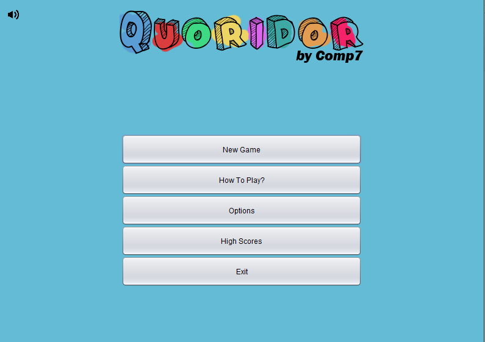
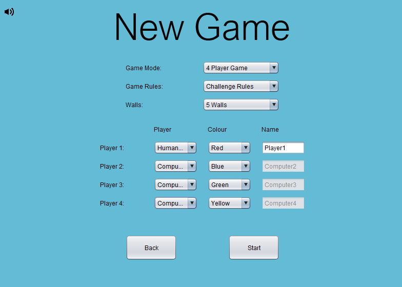
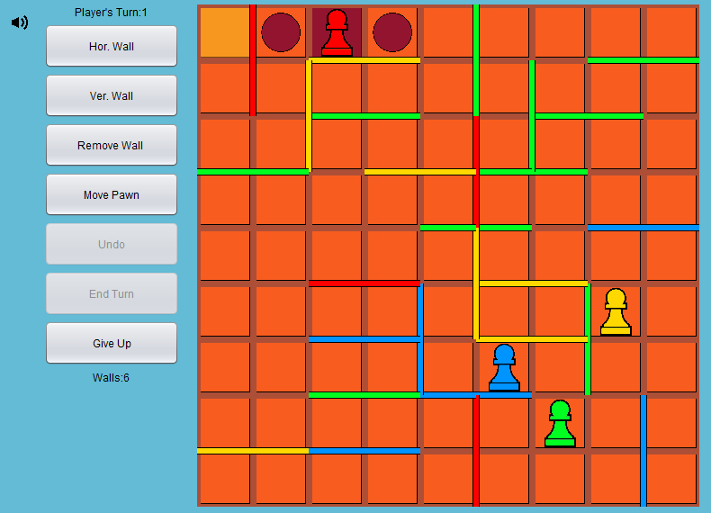

# Quoridor Group Project
A Quoridor game application I worked on for a group project using Java. 
<h5>What I contributed:</h5>
My role for the project was to be one of the lead programmers for the game. I mainly worked on the models & the actual gameplay of Quoridor, including the gameplay GUI and all the functionality of the game itself with the AI.
When we first started the project I began by creating the UML for the models we would be using for the game, this helped for when I created the base skeleton for the actual models in Java. The models would define how the individual game pieces were going to interact in the future of the game development. The base models changed quite a lot through every iteration of the game, in the end we settled with a model façade to pass all the model objects to and from the gameplay. The models we used were a board, a pawn, a wall and a coordinate, using just these 4 components we were able to create the core for the game.

Once the models were all setup I then began working on attaching them to the Quoridor class in the gameplay package which handles all the functionality of the game. I setup the board and the player pawns firstly, then began creating the board and pawn visuals for the GUI which a team member had created earlier. Once I had got the players pawns moving on the board GUI with move validation, it was time to begin adding the walls to the Quoridor gameplay and how the visuals would interact with the board. Defining how the walls would be placed was quite difficult as I had to check that none of the players routes were being completely blocked, which I did using a maze solving algorithm shown to us in the stacks lecture of the first term module Data Structures & Algorithms. I then created an undo button and functionality to undo the turn if a user makes a mistake & I setup all the shortcuts a team member had provided from the key binding and controls classes to work with the game.
Now that all the core functionality for the gameplay was setup I decided it would be a good idea to create an AI for practicing the game. Creating the AI was very enjoyable! I reused part of the maze solving algorithm from earlier however I modified it so that it now recorded the route that it used to find the finish location, this was very frustrating at first but eventually I figured it out and improved parts of it. The algorithm favoured the directions which were given to it first so I now had it using 24 permutations of the directions north, east, south, west to find which permutation would be generate the shortest route taking into account the selected player and the walls around them. I also managed to create an extra algorithm which would look for loops in the given circuit and cut them out to shorten the routes even further. 
The main algorithm which found the quickest route for the selected player would use the 24 shortened routes generated and select the one with the shortest path. This algorithm was also used by the computer to find other players quickest routes so that the computer could block that route.

Now that we had the main functionality to the game working, with the group we worked on reformatting the GUI. I also made a little sound track and sound button for the game to give it a bit more character.
By Michael Murray 

###[The Code](Code/)

<h1>Screen Shots</h1>
<h4>Main Menu Screen:</h4>

<h4>New Game Screen:</h4>

<h4>AI Game Screen:</h4>

